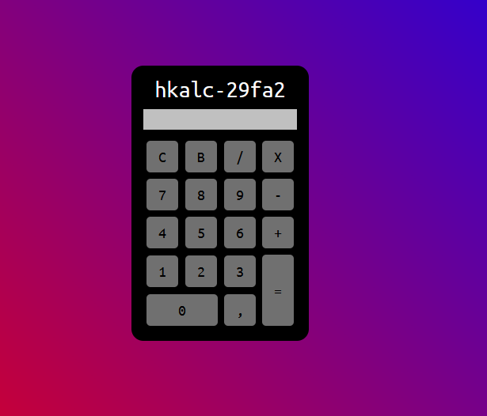
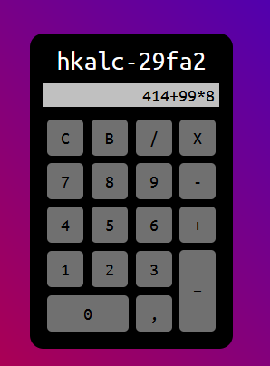
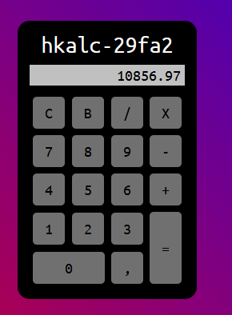

# calc_html-css

## calculator in html css and js

### design inspired by: [Gustavo Neitzke](https://youtu.be/42TShjXR0m0)

version 1.0 **hkalc-29fa2**

minimalist

multi operations

decimal accounts

design inspired by: [Gustavo Neitzke](https://youtu.be/42TShjXR0m0)

youtube: [Gustavo Neitzke](https://www.youtube.com/channel/UCd8w8Xlc9l8RZ5vHAEGKqWA)

github: [Gutoneitzke](https://github.com/Gutoneitzke/)

repo: [calculadora](https://github.com/Gutoneitzke/calculadora)
